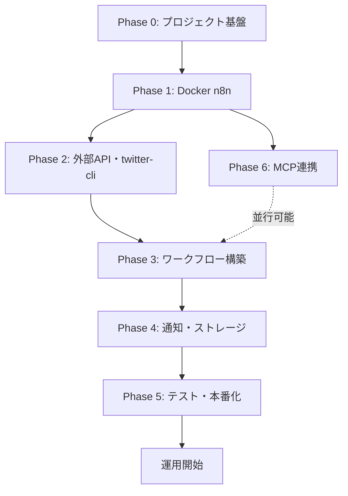

# AIトレンド抽出・リード獲得システム 構築タスク一覧（Docker版）

本ドキュメントは、以下の2つの仕様書に基づき、**n8n を Docker で運用する前提**でシステム構築を進めるためのタスク整理書である。

- `specs/AIトレンド抽出・リード獲得システム 構築設計書兼手順書.md`
- `specs/AIトレンド抽出システム構築仕様書.md`

---

## 1. 構築の目的と成果物

### 1.1 ゴール

毎朝7時に自動起動し、X / note / Brain / Tips / Qiita の5ソースから直近3〜5日の超短期トレンドを収集。Gemini 2.5 Flash で顧客獲得（リードマグネット）視点の分析を行い、Slack / Discord 等へ速報を配信する。

### 1.2 完成時の成果物

| 成果物 | 説明 |
|--------|------|
| `docker-compose.yml` | n8n + 永続ボリューム + 環境変数の定義 |
| `Dockerfile`（カスタムイメージ） | `twitter-cli` を含む n8n 実行環境 |
| `.env.example` | APIキー・Webhook等のテンプレート（秘密情報は含めない） |
| n8n ワークフロー JSON | エクスポート済みワークフロー（バージョン管理用） |
| `mock/` ディレクトリ | 開発・テスト用の擬似 X データ（`.json`） |
| 運用チェックリスト | Cookie更新・障害対応手順 |

---

## 2. Docker 版アーキテクチャ

仕様書の npm 直接起動を **Docker Compose** に置き換えた構成図。

```
[ホストマシン]
  ├─ docker-compose up
  │     └─ n8n コンテナ（カスタムイメージ）
  │           ├─ twitter-cli（コンテナ内インストール）
  │           ├─ twitter 認証情報（ボリュームマウント）
  │           └─ Execute Command ノードでシェル実行
  │
  ├─ 永続ボリューム: n8n_data（ワークフロー・認証情報）
  └─ オプション: mock データのボリュームマウント

[n8n ワークフロー（コンテナ内）]
  Schedule Trigger (毎朝 07:00)
    ├─ Execute Command ── X (twitter-cli)
    ├─ RSS Read ───────── note（2フィード）
    ├─ HTTP Request ───── Brain API
    ├─ HTTP Request ───── Tips
    └─ HTTP Request ───── Qiita API
           │
           ▼
    Code (JavaScript) ── データ統合・クレンジング
           │
           ▼
    Basic LLM Chain ──── Gemini 2.5 Flash + Structured Output Parser
           │
           ├─ Google Sheets / Notion（任意）
           └─ Slack / Discord 通知
```

### 2.1 Docker 採用時の重要な設計判断

| 項目 | npm 版（仕様書記載） | Docker 版（本書） |
|------|---------------------|-------------------|
| n8n 起動 | `n8n start` | `docker compose up -d` |
| Execute Command | ホストの `twitter-cli` をそのまま利用 | **カスタムイメージに `twitter-cli` を同梱**、またはホストバイナリをマウント |
| Cookie 認証 | ホストの `~/.config` 等 | **ボリュームマウント**でコンテナと共有 |
| 環境変数 | `export` で設定 | `docker-compose.yml` / `.env` で設定 |
| データ永続化 | ローカル DB | **名前付きボリューム** `n8n_data` |

---

## 3. 前提条件

### 3.1 ホスト環境

- [ ] Docker Desktop（macOS）または Docker Engine + Compose v2（Linux）
- [ ] ディスク空き 5GB 以上（n8n データ + ログ）
- [ ] ポート `5678` が未使用であること

### 3.2 アカウント・認証情報（構築前に準備）

| 項目 | 必須 | 用途 |
|------|------|------|
| X（Twitter）サブアカウント | 必須 | Cookie 抽出・データ収集用 |
| Google AI Studio API キー | 必須 | Gemini 2.5 Flash |
| Slack Incoming Webhook URL | 推奨 | 朝刊速報通知 |
| Qiita アクセストークン | 任意 | API レートリミット緩和 |
| Notion API / Google Sheets | 任意 | トレンド DB 蓄積 |
| n8n Personal API Key | 任意（MCP 用） | Cursor / Claude からの自律構築 |

---

## 4. フェーズ別構築タスク

### Phase 0: プロジェクト基盤の整備

**目的**: リポジトリ上で再現可能な Docker 環境の骨格を作る。

| ID | タスク | 詳細 | 完了条件 |
|----|--------|------|----------|
| P0-1 | ディレクトリ構成の作成 | `docker/`, `workflows/`, `mock/`, `scripts/` を作成 | ディレクトリが存在する |
| P0-2 | `.env.example` の作成 | 必要な環境変数を列挙（値はプレースホルダ） | 全必須変数が記載されている |
| P0-3 | `.gitignore` の更新 | `.env`, `n8n_data/`, Cookie 関連パスを除外 | 秘密情報がコミットされない |
| P0-4 | README の更新 | クイックスタート（`docker compose up`）を追記 | 初回起動手順が記載されている |

**推奨ディレクトリ構成**:

```
n8n-ai-trend-extractor/
├── docker/
│   ├── Dockerfile          # twitter-cli 同梱 n8n イメージ
│   └── entrypoint.sh       # 起動前の権限・パス設定（任意）
├── docker-compose.yml
├── .env.example
├── workflows/
│   └── ai-trend-extractor.json   # エクスポート済みワークフロー
├── mock/
│   └── x-tweets-sample.json      # テスト用擬似データ
├── scripts/
│   ├── setup-twitter-cli.sh      # ホスト側セットアップ補助
│   └── verify-sources.sh         # 各ソースの疎通確認
└── specs/
    └── （既存仕様書）
```

---

### Phase 1: Docker 上の n8n 環境構築

**目的**: Execute Command が動作する n8n コンテナを起動できる状態にする。

| ID | タスク | 詳細 | 完了条件 |
|----|--------|------|----------|
| P1-1 | カスタム `Dockerfile` 作成 | ベース: `n8nio/n8n:1.x.x`（**バージョンを固定すること**。`latest` タグは破壊的変更を含むアップデートがあり得る）、Node.js 経由で `@public-clis/twitter-cli` をグローバルインストール | イメージビルドが成功する |
| P1-2 | `docker-compose.yml` 作成 | サービス定義、ポート `5678:5678`、ボリューム、環境変数 | `docker compose up -d` で起動する |
| P1-3 | n8n 必須環境変数の設定 | 下記「1.1 環境変数一覧」を `.env` に設定 | GUI (`http://localhost:5678`) にアクセスできる |
| P1-4 | 永続ボリュームの設定 | `n8n_data` ボリュームでワークフロー・認証を保持 | コンテナ再起動後もデータが残る |
| P1-5 | Execute Command 有効化の確認 | n8n 設定でシェルコマンド実行が許可されていることを確認 | テスト用 `echo hello` が成功する |
| P1-6 | タイムゾーン設定 | `TZ=Asia/Tokyo`、Schedule Trigger が JST 07:00 になるよう調整 | スケジュールが意図した時刻で動く |

#### 1.1 環境変数一覧（`.env`）

```env
# n8n 基本設定
N8N_HOST=localhost
N8N_PORT=5678
N8N_PROTOCOL=http
GENERIC_TIMEZONE=Asia/Tokyo
TZ=Asia/Tokyo

# Execute Command / Code ノード用（仕様書必須）
N8N_ENFORCE_SETTINGS_FILE_PERMISSIONS=true
N8N_BLOCK_ENV_ACCESS_IN_NODE=false

# 認証情報（n8n Credentials にも登録するが、参照用に保持）
GEMINI_API_KEY=your_gemini_api_key
QIITA_ACCESS_TOKEN=your_qiita_token_optional
SLACK_WEBHOOK_URL=your_slack_webhook_url

# MCP 連携（Phase 6・任意）
N8N_API_KEY=your_n8n_api_key
N8N_BASE_URL=http://localhost:5678
```

#### 1.2 `docker-compose.yml` 設定要点

```yaml
# 要点のみ（実装時にフル版を作成）
services:
  n8n:
    build: ./docker
    ports:
      - "5678:5678"
    environment:
      - N8N_ENFORCE_SETTINGS_FILE_PERMISSIONS=true
      - N8N_BLOCK_ENV_ACCESS_IN_NODE=false
      - GENERIC_TIMEZONE=Asia/Tokyo
      - TZ=Asia/Tokyo
    volumes:
      - n8n_data:/home/node/.n8n
      # twitter-cli 認証情報をホストと共有
      # ⚠️ コンテナ内の実際のパスは P1-9 で確認してから設定すること
      # （デフォルト候補: /home/node/.config/twitter-cli または /home/node/.local/share/twitter-cli）
      - ./data/twitter-cli:/home/node/.config/twitter-cli
      # 開発時のモックデータ
      - ./mock:/data/mock:ro
volumes:
  n8n_data:
```

| ID | タスク | 詳細 | 完了条件 |
|----|--------|------|----------|
| P1-7 | 初回オーナーアカウント作成 | n8n GUI でオーナーユーザーを登録 | ログインできる |
| P1-8 | n8n Credentials の基盤登録 | Gemini API キーを n8n の Credential として保存（.env の `GEMINI_API_KEY` とは別管理。LLMノードは n8n Credential を参照する） | Credential テストが成功する |
| P1-9 | twitter-cli 設定ファイルパスの確認 | コンテナ内で `twitter login` を実行後、`find /home/node -name "*.json" 2>/dev/null` 等で実際の設定ファイル格納パスを特定し、docker-compose.yml のボリュームマウントパスを修正する | コンテナ再起動後も認証が維持される |

---

### Phase 2: 外部ツール・API のセットアップ

**目的**: 5つのデータソースと通知先の認証・疎通を完了する。

| ID | タスク | 詳細 | 完了条件 |
|----|--------|------|----------|
| P2-1 | X Cookie の抽出 | ブラウザ DevTools → `auth_token`, `ct0` を取得 | 2つの値を安全に保管 |
| P2-2 | `twitter-cli` 認証（ホスト） | `twitter login` → Cookie ログイン | ホストで `twitter search "Dify" --json` が動作 |
| P2-3 | `twitter-cli` 認証（コンテナ） | ボリュームマウント or コンテナ内で `twitter login` | コンテナ内 Execute Command で検索成功 |
| P2-4 | X 検索クエリの動作確認 | 仕様書の本番クエリを `--since` / `--until` 付きで実行 | JSON が返る |
| P2-5 | note RSS の疎通確認 | 2フィード URL に HTTP アクセス | XML/RSS が取得できる |
| P2-6 | Brain API の疎通確認 | `GET https://brain-market.com/api/v1/search?keyword=AI&sort=new` | レスポンスを確認（HTML/JSON の構造を把握） |
| P2-7 | Tips の疎通確認 | `GET https://tips.jp/search?q=AI` | レスポンス構造を把握（HTML パース要否を判断） |
| P2-8 | Qiita API の疎通確認 | `GET https://qiita.com/api/v2/items?query=tag:AI` + Bearer トークン | JSON 配列が返る |
| P2-9 | Slack Webhook の作成・テスト | Incoming Webhook を作成し curl で送信テスト | テストメッセージが届く |
| P2-10 | Gemini API の疎通確認 | Google AI Studio で API キー発行、n8n の Google Gemini Chat Model ノードで選択可能なモデルIDを確認する（`gemini-2.5-flash` の他に `-preview` 等のサフィックスが必要な場合がある） | 簡易プロンプトで応答がある |

#### 2.1 注意: Brain / Tips のレスポンス形式

仕様書では HTTP Request ノードで取得しているが、実際の API は **HTML または非標準 JSON** の可能性がある。構築時に以下を確認するタスクを追加する。

| ID | タスク | 詳細 | 完了条件 |
|----|--------|------|----------|
| P2-11 | Brain/Tips パーサー設計 | レスポンスが HTML の場合、Code ノード内で cheerio 相当の処理 or 別エンドポイント調査 | Code ノードで `title` / `price` が取れる |
| P2-12 | モックデータの準備 | `mock/x-tweets-sample.json` を作成 | **`Read/Write Files from Disk`** ノードで読み込める（n8n v1.x では `Read Binary File` ノードは廃止されこのノードに統合された） |

---

### Phase 3: n8n ワークフロー構築

**目的**: 仕様書どおりのマルチソース収集 → 分析 → 出力フローを n8n 上に構築する。

#### 3.1 ワークフロー骨格

| ID | タスク | ノード | 設定要点 | 完了条件 |
|----|--------|--------|----------|----------|
| P3-1 | スケジュール設定 | Schedule Trigger | 毎日 07:00 JST（`GENERIC_TIMEZONE=Asia/Tokyo`、cron: `0 7 * * *`） | 手動実行で下流が起動する |
| P3-2 | X データ収集 | Execute Command（ノード名: `Execute Command`） | 仕様書の検索コマンド（`min_faves:15`, `--until` は `$today.plus({ days: 1 })` で当日含む） | stdout に JSON が入る |
| P3-3 | note 収集（1） | RSS Read（ノード名: `RSS Read (note-AI副業)`） | `https://note.com/hashtag/ai%E5%89%AF%E6%A5%AD/rss` | 記事リストが取得できる |
| P3-4 | note 収集（2） | RSS Read（ノード名: `RSS Read (note-AIツール)`） | `https://note.com/hashtag/ai%E3%83%84%E3%83%BC%E3%83%AB/rss` | 記事リストが取得できる |
| P3-5 | Brain 収集 | HTTP Request（ノード名: `HTTP Request (Brain)`） | `GET .../api/v1/search?keyword=AI&sort=new`（P2-6疎通確認でHTMLの場合はパーサー実装が必要） | レスポンスを次ノードへ渡せる |
| P3-6 | Tips 収集 | HTTP Request（ノード名: `HTTP Request (Tips)`） | `GET https://tips.jp/search?q=AI`（P2-7疎通確認でHTMLの場合はパーサー実装が必要） | レスポンスを次ノードへ渡せる |
| P3-7 | Qiita 収集 | HTTP Request（ノード名: `HTTP Request (Qiita)`） | `query=tag:AI+created:>=` + 3日前日付、Bearer 認証 | 記事 JSON が取得できる |
| P3-8 | 並列実行の接続 | **Merge ノード**（Wait for All Items）→ Code | 5ブランチをすべて Merge ノードで合流させてから Code ノードへ渡す。**Mergeノードなしでは Code が1ブランチの出力しか受け取れない。** Code 内では `$node["ノード名"].all()`（n8n v1.x 構文）を使用。 | Code ノードが全ソースを参照できる |

#### 3.2 データ処理・AI 分析

| ID | タスク | ノード | 設定要点 | 完了条件 |
|----|--------|--------|----------|----------|
| P3-9 | データ統合 | Code (JS) | `構築仕様書.md §4.3` のクレンジングコードを実装（`$node["ノード名"].all()` 構文を使用、ノード名は P3-2〜P3-7 で付けた名前に合わせる） | `textData` が1アイテムで出力される |
| P3-10 | LLM モデル接続 | Google Gemini Chat Model | Model: P2-10で確認した正確なモデルID、Temperature: `0.3` | Credential 接続済み |
| P3-11 | 構造化出力 | Structured Output Parser | **構築仕様書.md §4.4②** の統一スキーマ（`tech_status_pain` / `lead_hook` / `category` フィールドのもの）を使用 | パースエラーなく JSON 化される |
| P3-12 | 分析チェーン | Basic LLM Chain | 仕様書のシステムプロンプト（顧客獲得視点） | 最大5トレンド + リードマグネット案が出力される |
| P3-14 | 通知用フォーマット | Code (JS)（ノード名: `Code (Format Notification)`） | `構築仕様書.md §4.5①` のコードを実装して Slack テキストを生成する（Handlebars 構文は n8n 非対応のため使用不可） | `text` フィールドに整形済み文字列が出力される |

#### 3.3 スキーマ統一（解決済み）

2つの仕様書でフィールド名が異なっていたが、**`構築仕様書.md §4.4②` のスキーマに統一済み**。設計書（手順書）の旧スキーマには廃止注記を追記した。実装時は必ず仕様書スキーマを使うこと。

| 旧フィールド（設計書） | 統一後フィールド（仕様書） |
|------|------|
| `target_pain` | `tech_status_pain` |
| `lead_magnet_title` + `lead_magnet_content` | `lead_hook` |
| （なし） | `category` |

| ID | タスク | 詳細 | 完了条件 |
|----|--------|------|----------|
| P3-13 | JSON スキーマの確定 | `構築仕様書.md §4.4②` の統一スキーマで Parser を設定（設計書旧スキーマは使用しない） | 通知フォーマット（P3-14）とフィールドが一致する |

---

### Phase 4: ストレージ・通知連携

**目的**: 分析結果を人間が朝一で活用できる形で届ける。

| ID | タスク | ノード | 詳細 | 完了条件 |
|----|--------|--------|------|----------|
| P4-1 | Slack 通知 | HTTP Request or Slack ノード | P3-14 の `Code (Format Notification)` が出力した `$json.text` を Slack ノードの Text フィールドに渡す | フォーマット済みメッセージが届く |
| P4-2 | Discord 通知（任意） | HTTP Request | Webhook URL に POST | メッセージが届く |
| P4-3 | Google Sheets 蓄積（任意） | Google Sheets ノード | トレンドを行追加（日付・キーワード・スコア） | シートに履歴が残る |
| P4-4 | Notion 蓄積（任意） | Notion ノード | データベースにページ作成 | Notion DB にレコードが増える |
| P4-5 | ワークフロー JSON エクスポート | — | `workflows/ai-trend-extractor.json` に保存 | Git でバージョン管理できる |

#### 4.1 Slack 通知フォーマット（Codeノードで生成）

> ⚠️ n8n は Handlebars（`{{#each}}`）非対応。**`構築仕様書.md §4.5①` に掲載の Codeノード（P3-14）で文字列生成すること。** 下記は出力イメージ（参考）。

```
📢 【朝刊】マルチソースAI実需分析 ＆ 顧客獲得（リード）戦略速報 📢

🔥 キーワード: 【ClaudeCode】 （カテゴリ: 開発自動化 / 顧客獲得価値: 高（即時実践推奨））
・ターゲットの実売需要: ...
・ターゲットの実装上の悩み: ...
💡 【顧客獲得（リード）施策案】:
👉 『 ... 』
--------------------------------------------------
```

---

### Phase 5: エラーハンドリング・テスト・本番化

**目的**: 安全に本番運用できる状態にする。

| ID | タスク | 詳細 | 完了条件 |
|----|--------|------|----------|
| P5-1 | Error Trigger ワークフロー作成 | 別ワークフローとして作成。構成: `Error Trigger` → `Code（エラー内容フォーマット）` → `HTTP Request（Slack Webhook POST）`。エラーメッセージには `{{ $json.execution.error.message }}` と `{{ $json.execution.url }}` を含める | 意図的エラーでサブフローが起動しSlackに通知が届く |
| P5-2 | Cookie 切れアラート | P5-1 の Error Trigger フローがキャッチした際、Slack メッセージに「X Cookie の再設定が必要です。手順: ...」を含めてオペレーターが即座に対応できるようにする | モックエラーで通知確認 |
| P5-3 | モックモードの実装 | `IF` ノードで `{{ $env.USE_MOCK_X }}` が `"true"` か否かを判定し、trueの場合は `Read/Write Files from Disk` ノード（`/data/mock/x-tweets-sample.json`）へ、falseの場合は `Execute Command` へ分岐させる（**n8n v1.x では `Read Binary File` ノードは廃止**） | X API を叩かずに E2E テスト可能 |
| P5-4 | E2E テスト（モック） | 全ノードを通し、Slack まで到達 | 朝刊フォーマットの通知が届く |
| P5-5 | E2E テスト（本番 X） | `twitter-cli` 本番クエリで1回実行 | 実データで分析結果が得られる |
| P5-6 | スケジュール有効化 | Schedule Trigger を Active に設定 | 翌朝7時に自動実行される |
| P5-7 | 実行ログ・監視 | n8n Executions 画面で失敗を確認する手順を文書化 | 運用者が毎日確認できる |

---

### Phase 6: n8n MCP 連携（任意・推奨）

**目的**: Cursor / Claude Desktop から自然言語でワークフローを自律構築・改修できるようにする（設計書 第3章）。

| ID | タスク | 詳細 | 完了条件 |
|----|--------|------|----------|
| P6-1 | n8n Personal API Key 発行 | Settings → Personal API Keys | キーを安全に保管 |
| P6-2 | MCP サーバー設定 | `@n8n/mcp-server` を Cursor / Claude Desktop に追加 | MCP ツール一覧に n8n が表示される |
| P6-3 | 接続テスト | AI エージェントに「ワークフロー一覧を取得」と指示 | 一覧が返る |
| P6-4 | 自律構築テスト | 設計書のプロンプト例でワークフロー作成を依頼 | 新規ワークフローが n8n 上に作成される |

#### 6.1 MCP 設定例（Cursor / Claude Desktop）

```json
{
  "mcpServers": {
    "n8n-mcp-server": {
      "command": "npx",
      "args": ["-y", "@n8n/mcp-server"],
      "env": {
        "N8N_API_KEY": "n8n_api_xxxxxxxx",
        "N8N_BASE_URL": "http://localhost:5678"
      }
    }
  }
}
```

---

## 5. タスク依存関係（実行順序）



**クリティカルパス**: P0 → P1 → P2（特に P2-3 twitter-cli コンテナ認証）→ P3 → P4 → P5

---

## 6. マスターチェックリスト

構築進捗を一覧で管理するためのチェックリスト。完了したら `[x]` に変更する。

### 6.1 環境・インフラ

- [ ] P0-1 ディレクトリ構成作成
- [ ] P0-2 `.env.example` 作成
- [ ] P0-3 `.gitignore` 更新
- [ ] P1-1 Dockerfile 作成・ビルド成功
- [ ] P1-2 docker-compose.yml 作成
- [ ] P1-3 環境変数設定
- [ ] P1-4 永続ボリューム動作確認
- [ ] P1-5 Execute Command 動作確認
- [ ] P1-6 タイムゾーン JST 確認
- [ ] P1-7 n8n オーナーアカウント作成
- [ ] P1-8 Gemini Credential 登録
- [ ] P1-9 twitter-cli 設定ファイルパス確認・ボリューム設定修正

### 6.2 データソース・認証

- [ ] P2-1 X Cookie 抽出
- [ ] P2-2 twitter-cli ホスト認証
- [ ] P2-3 twitter-cli コンテナ認証
- [ ] P2-4 X 本番検索クエリ確認
- [ ] P2-5 note RSS 疎通
- [ ] P2-6 Brain API 疎通・構造把握
- [ ] P2-7 Tips 疎通・構造把握
- [ ] P2-8 Qiita API 疎通
- [ ] P2-9 Slack Webhook テスト
- [ ] P2-10 Gemini API テスト
- [ ] P2-11 Brain/Tips パーサー実装
- [ ] P2-12 モックデータ準備

### 6.3 ワークフロー

- [ ] P3-1 Schedule Trigger
- [ ] P3-2 Execute Command (X)
- [ ] P3-3〜P3-7 各ソース収集ノード
- [ ] P3-8 Mergeノード（Wait for All Items）→ Code 接続
- [ ] P3-9 Code 統合・クレンジング（`$node[].all()` 構文）
- [ ] P3-10 Gemini Chat Model（モデルID確認済み）
- [ ] P3-11 Structured Output Parser（統一スキーマ）
- [ ] P3-12 Basic LLM Chain + プロンプト
- [ ] P3-13 JSON スキーマ確定（構築仕様書 §4.4②）
- [ ] P3-14 通知フォーマット Codeノード実装

### 6.4 出力・運用

- [ ] P4-1 Slack 朝刊通知
- [ ] P4-2 Discord 通知（任意）
- [ ] P4-3 Google Sheets（任意）
- [ ] P4-4 Notion（任意）
- [ ] P4-5 ワークフロー JSON エクスポート
- [ ] P5-1 Error Trigger
- [ ] P5-2 Cookie 切れアラート
- [ ] P5-3 モックモード
- [ ] P5-4 E2E テスト（モック）
- [ ] P5-5 E2E テスト（本番 X）
- [ ] P5-6 スケジュール有効化
- [ ] P5-7 運用手順の文書化

### 6.5 MCP（任意）

- [ ] P6-1 n8n API Key 発行
- [ ] P6-2 MCP サーバー設定
- [ ] P6-3 接続テスト
- [ ] P6-4 自律構築テスト

---

## 7. 工数見積もり（目安）

| フェーズ | 想定工数 | 備考 |
|----------|----------|------|
| Phase 0 | 0.5〜1h | ディレクトリ・設定ファイル |
| Phase 1 | 2〜4h | Dockerfile 調整・twitter-cli 設定パス確認（P1-9）に時間がかかる場合あり |
| Phase 2 | 2〜3h | Brain/Tips の HTML 対応で +2h の可能性。Gemini モデルID確認は通常10分以内 |
| Phase 3 | 3〜5h | Mergeノード + Codeノード（v1.x構文）+ 通知フォーマットCodノード（P3-14追加分）|
| Phase 4 | 1〜2h | Slack のみなら短時間 |
| Phase 5 | 2〜3h | モックテスト・エラーハンドリング |
| Phase 6 | 1〜2h | 任意 |
| **合計** | **12〜20h** | 初回構築・Brain/Tips 未調査時 |

---

## 8. リスクと対策

| リスク | 影響 | 対策タスク |
|--------|------|------------|
| X Cookie の定期失効（月1回程度） | X データ収集停止 | P5-2 アラート。**更新手順**: ①ブラウザで X にログイン → DevTools → Application → Cookies → `auth_token` と `ct0` を取得 → ②ホストで `twitter login`（Cookie再設定）→ ③ホストの認証ファイルがボリューム経由でコンテナに反映されることを確認（コンテナ再起動は不要） |
| docker-cli のコンテナ内設定パスが不明 | Cookie ボリュームマウントが機能しない | P1-9 でパスを確定 |
| Docker 内で `twitter-cli` が動かない | Execute Command 失敗 | P1-1 カスタムイメージ（バージョン固定）、P2-3 コンテナ内認証 |
| Brain/Tips が HTML 返却 | Code ノードでパース失敗（エラーはキャッチ済みだが空データとしてGeminiに渡る） | P2-11 構造調査、必要なら専用スクレイピング |
| Gemini API レート制限 | 分析失敗 | リトライノード追加、トークン量削減（上位 N 件制限は既に Code で実施） |
| n8n Execute Command のセキュリティ | コンテナ侵害リスク | 本番は必要最小限のコマンドのみ、ネットワーク分離検討 |
| n8n v1.x の `$items()` 廃止 | Code ノードが実行エラー | P3-9: `$node["ノード名"].all()` を使用（仕様書コードは修正済み） |
| Handlebars 構文が n8n 非対応 | 通知文字列が生成されない | P3-14: Codeノードで整形する（仕様書修正済み） |
| 仕様書間のスキーマ不一致 | 通知テンプレート崩れ | 解決済み（P3-13・設計書に廃止注記済み） |

---

## 9. 次のアクション（推奨着手順）

1. **Phase 0 + Phase 1** を一気に実施し、`http://localhost:5678` で n8n GUI を開く
2. **Phase 2** で twitter-cli と各 API の疎通をホスト・コンテナ両方で確認
3. **Phase 3** はモックデータ（P2-12）で先に Code + LLM まで通し、X 本番は最後に接続
4. **Phase 4〜5** で Slack 通知と Error Trigger を仕上げ、スケジュールを有効化
5. **Phase 6** は運用安定後に MCP でワークフロー改修の自動化を追加

---

## 10. 参照

- 設計書: `specs/AIトレンド抽出・リード獲得システム 構築設計書兼手順書.md`（MCP・Error Trigger・モックテスト）
- 仕様書: `specs/AIトレンド抽出システム構築仕様書.md`（5ソース詳細・通知テンプレート・運用ノウハウ）
- n8n Docker 公式: https://docs.n8n.io/hosting/installation/docker/
- twitter-cli: `@public-clis/twitter-cli`
